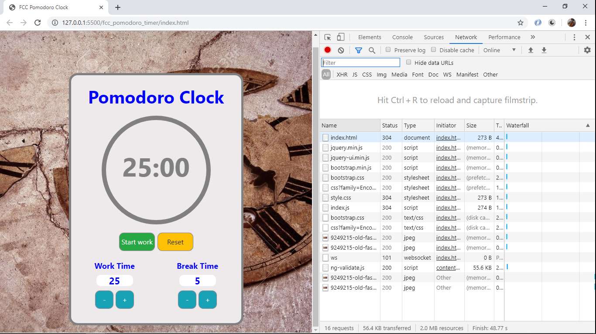
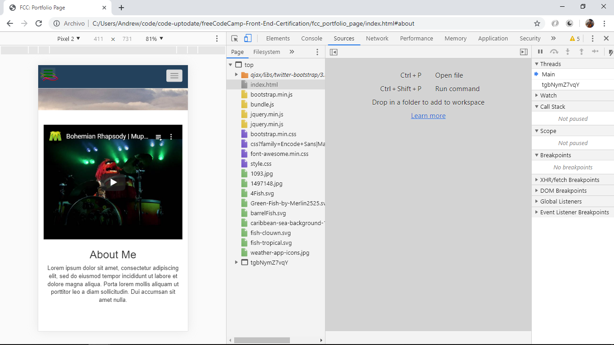
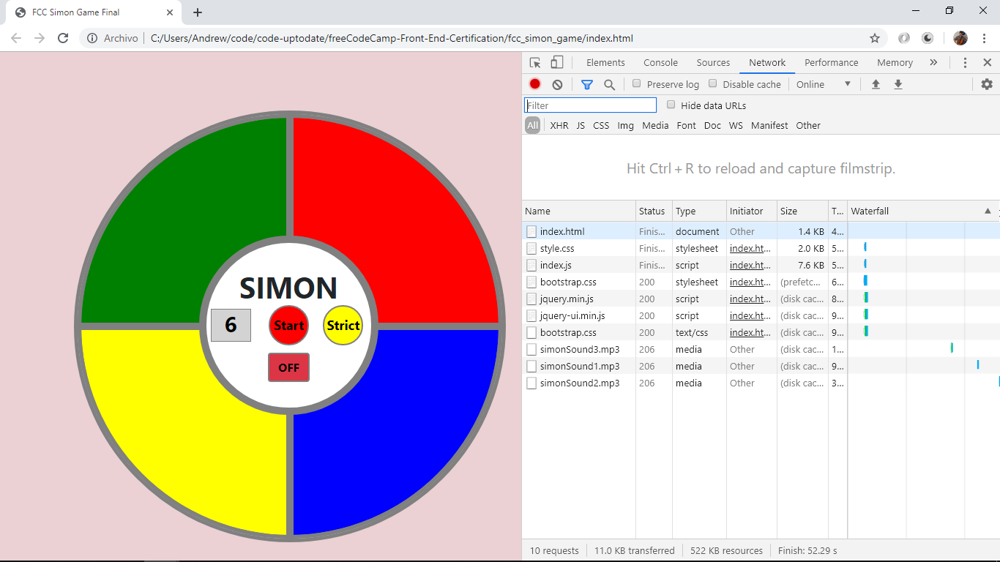
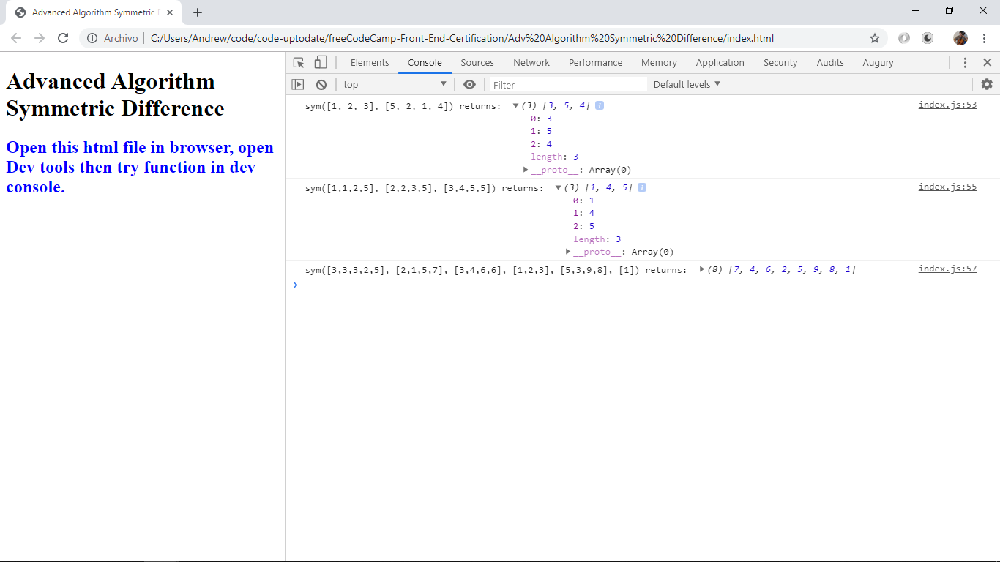
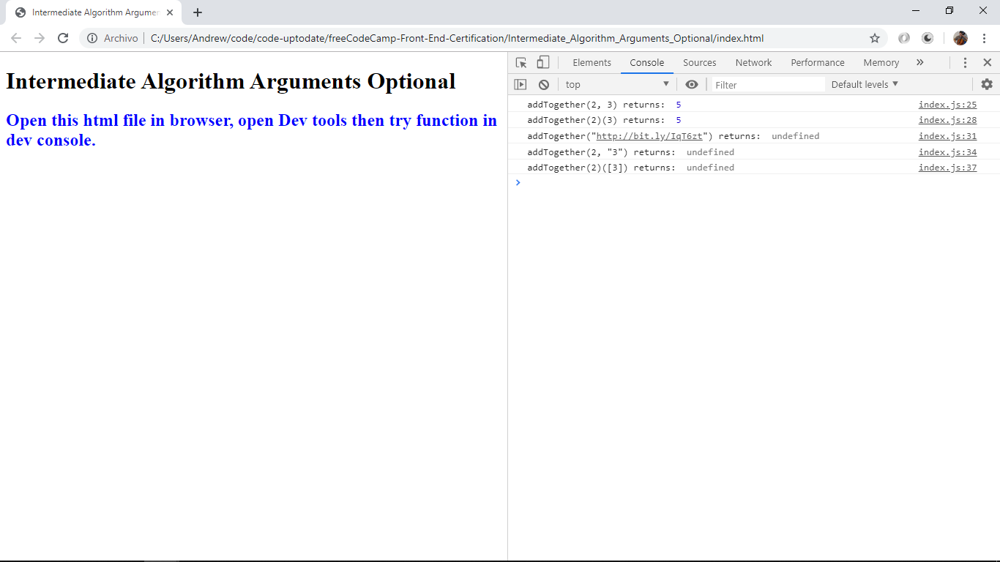
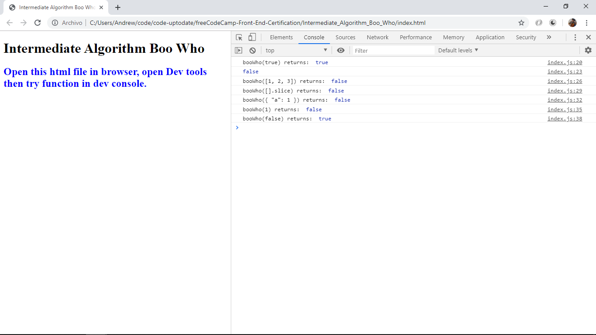
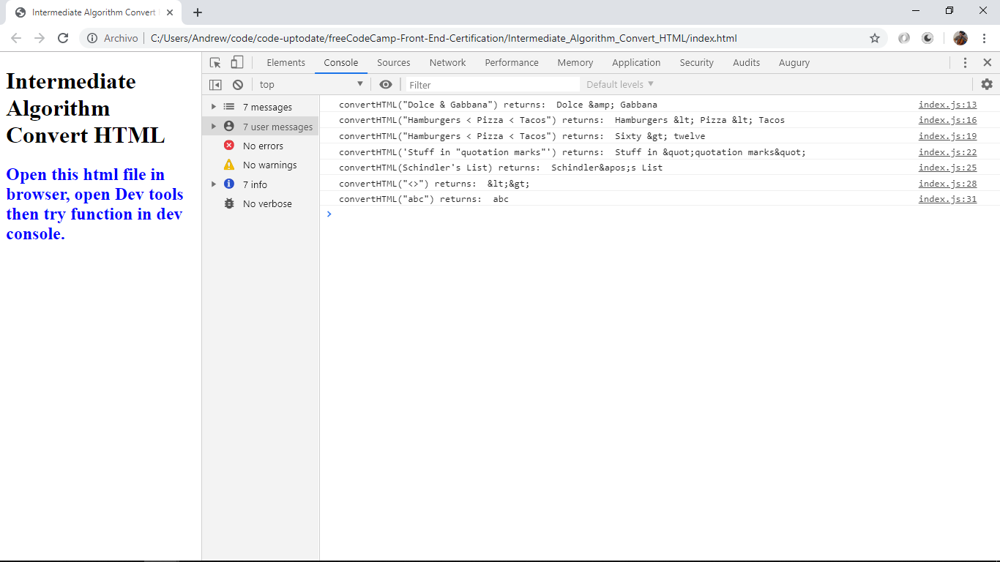
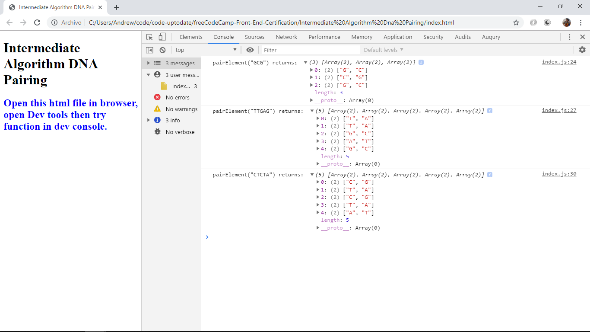

# Javascript Front End Certification

* Contains my code created to meet challenges in the JavaScript Full Stack Web Development Program at Free Code Camp. Help from Youtube videos and other info sources is acknowledged in the 'Inspiration' section below.

## Projects

* FCC Pomodoro Timer: Uses jQuery to show/hide elements (such as buttons) in the DOM. setInterval and clearInterval methods used to set and clear time in seconds. It works ok in normal PC screen size but is not fully-responsive - in phone-sized screen the timer is too small. Some of the colours (esp. timer background) do not give buttons sufficient contrast.

* FCC Portfolio Page: responsive personal website created using html & css. Includes Youtube video that plays using iframe.

* FCC Simon Game: uses html. css & jQuery to create this famous game that flashes 4 coloured buttons and plays 4 different audio files. Player sequence compared with random sequence to see if player can progress to a longer sequence. Includes strict mode that resets if a mistake is made.

## Algorithms

### Array methods used

call - calls a function with a given this value and arguments provided individually,
concat,
**every** - tests whether all elements in the array pass the test implemented by the provided function, returns a Boolean,
filter,
**flat**, creates a new array with all sub-array elements concatenated into it recursively up to the specified depth.
_Examples:
var arr1 = [1, 2, [3, 4]];
arr1.flat();
// [1, 2, 3, 4]

var arr2 = [1, 2, [3, 4, [5, 6]]];
arr2.flat();
// [1, 2, 3, 4, [5, 6]]

var arr3 = [1, 2, [3, 4, [5, 6]]];
arr3.flat(2);
// [1, 2, 3, 4, 5, 6]

var arr4 = [1, 2, [3, 4, [5, 6, [7, 8, [9, 10]]]]];
arr4.flat(Infinity);
// [1, 2, 3, 4, 5, 6, 7, 8, 9, 10]_

**forEach** - executes a provided function once for each value in the Set object, in insertion order,

includes,

Mathfloor - rounds number downwards to nearest integer,

Math.max,

Math.min,

reduce - executes a reducer function on each element of an array,

reverse,

shift,

**slice** - returns the part of the array specified, does not change original array,

some,

sort,

**splice** - returns removed items in an array, changing the original array

### String methods used

map,

regex,

replace,

toLowerCase, toUpperCase

### Object Methods

* JSON.stringify() method used, converts a JavaScript object or value to a JSON string.

* JSON.parse() method used, parses a JSON string, constructing the object described in the string.

* Object methods:

hasOwnProperty()

Object.keys() - returns an array of a given object's own enumerable property names, in the same order as we get with a normal loop. Note: enumerable can be set to false - default is true.

eg var json = '{"result":true, "count":42}';
obj = JSON.parse(json);

console.log(obj.count);
// expected output: 42

console.log(obj.result);
// expected output: true

typeof() returns the type of an object, function or variable: i.e. number, string, boolean or undefined.

**\* Note: to open web links in a new window use: _ctrl+click on link_**

## Table of contents

1. [General info](#general-info)
2. [Screenshots](#screenshots)
3. [Technologies](#technologies)
4. [Setup](#setup)
5. [Features](#features)
6. [Status & To-Do List](#status)
7. [Inspiration](#inspiration)
8. [Contact](#contact)

## Technologies

[Javascript v1.9 ECMA-262 ECMAScript 2018](http://www.ecma-international.org/publications/standards/Ecma-262.htm)
[html](https://html.spec.whatwg.org/multipage/)
[CSS](https://www.w3.org/Style/CSS/)
[jQuery](https://learn.jquery.com/)

## Setup

* cd into individual folders to view html & js/index.js files. Open html file in chrome dev tools and use dev console to enter function variables.

## Status & To-Do List

* Status: All projects listed under 'List of Projects' have been checked and are working.

* To-Do: Complete documentation of all projects. Change folder titles to remove spaces.

## Inspiration

* [Stephen Mayeux, Full Stack Developer Youtube Series](https://github.com/stephenmayeux)
* [Dylan Israel, Youtube Series](http://www.codingtutorials360.com/)
* [Mark Snow, Youtube Series](https://www.youtube.com/user/SnowmanSpeaks)
* [MDN Web Docs RegExp](https://developer.mozilla.org/en-US/docs/Web/JavaScript/Reference/Global_Objects/RegExp#Syntax)
* [FreeCodeCamp](https://www.freecodecamp.org/)
* [FreeCodeCamp Forum](https://www.freecodecamp.org/forum/)
* [Regex Expression Tester](https://regexr.com/)
* [Mozilla Web Docs - Javascript](https://developer.mozilla.org/en-US/docs/Web/JavaScript)

## List of Projects/Algorithms with Screenshot

* Project_Pomodoro

* Project_Website

* Simon_Game

* Adv_Algorithm_Exact_Change

* Adv_Algorithm_Validate_Phone_Number

* Adv_Algorithm_Caesars_Cipher

* Adv_Algorithm_Roman_Numeral_Converter

* Adv_Algorithm_Palindrome_Checker

* Intermediate_Algorithm_Sum_All_Numbers_in_a_Range

* Intermediate_Algorithm_Diff_Two_Arrays

* Intermediate_Algorithm_Search_And_Replace

* Intermediate_Algorithm_Sum_Odd_Fabonicci

* Intermediate_Algorithm_Map_The_Debris

* Intermediate_Algorithm_Binary_Agents

* Intermediate_Algorithm_Sum_All_Primes

* Intermediate_Algorithm_Steamroller

* Intermediate_Algorithm_Spinal_Tap

* Adv_Algorithm_Pairwise

* Adv_Algorithm_Record_Collection

* Adv_Algorithm_Inventory_Update

* Adv_Algorithm_Symmetric_Difference

* Adv_Algorithm_Make_A_Person

* Int_Algorithm_Args_Optional

* Int_Algorithm_Boo_Who

* Int_Algorithm_Convert_HTML

* Int_Algorithm_DNA_Pairing

* Int_Algorithm_Everything_Be_True

## Contact

Repo created by [ABateman](https://www.andrewbateman.org) - feel free to contact me!
