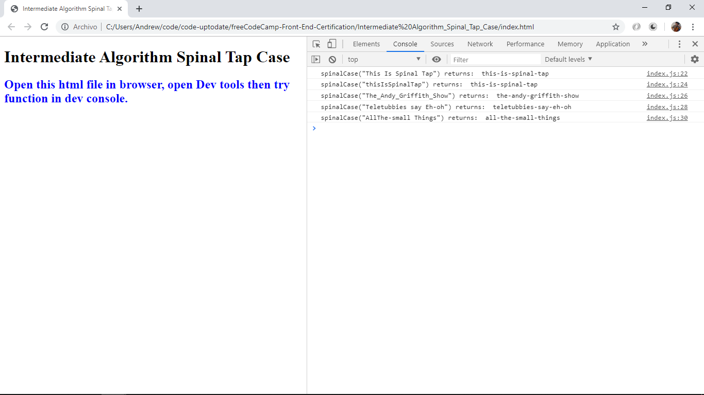

# Javascript Front End Certification

* Contains my code created to meet challenges in the JavaScript Full Stack Web Development Program at Free Code Camp.

* Array methods used: concat, filter, flatten, includes, Math.max, Math.min, reverse, shift

* String methods used: regex, replace, toLowerCase,

**\* Note: to open web links in a new window use: _ctrl+click on link_**

## Table of contents

1. [General info](#general-info)
2. [Screenshots](#screenshots)
3. [Technologies](#technologies)
4. [Setup](#setup)
5. [Features](#features)
6. [Status & To-Do List](#status)
7. [Inspiration](#inspiration)
8. [Contact](#contact)

## Technologies

[Javascript v1.9 ECMA-262 ECMAScript 2018](http://www.ecma-international.org/publications/standards/Ecma-262.htm)

## Setup

* cd into individual folders to view html & js/index.js files. Open html file in chrome dev tools and use dev console to enter function variables.

## Status & To-Do List

* Status: All projects listed under 'List of Projects' have been checked and are working.

* To-Do: Complete documentation of all projects. Change folder titles to remove spaces.

## Inspiration

* [Stephen Mayeux, Full Stack Developer Youtube Series](https://github.com/stephenmayeux)
* [Dylan Israel, Youtube Series](http://www.codingtutorials360.com/)
* [Mark Snow, Youtube Series](https://www.youtube.com/user/SnowmanSpeaks)
* [MDN Web Docs RegExp](https://developer.mozilla.org/en-US/docs/Web/JavaScript/Reference/Global_Objects/RegExp#Syntax)
* [FreeCodeCamp](https://www.freecodecamp.org/)
* [Regex Expression Tester](https://regexr.com/)

## List of Projects with Screenshot

* Adv_Algorithm_Exact_Change

* Adv_Algorithm_Validate_Phone_Number

* Adv_Algorithm_Caesars_Cipher

* Adv_Algorithm_Roman_Numeral_Converter

* Adv_Algorithm_Palindrome_Checker

* Intermediate_Algorithm_Sum_All_Numbers_in_a_Range

* Intermediate_Algorithm_Diff_Two_Arrays

* Intermediate_Algorithm_Search_And_Replace

* Intermediate_Algorithm_Sum_Odd_Fabonicci

* Intermediate_Algorithm_Map_The_Debris

* Intermediate_Algorithm_Binary_Agents

* Intermediate_Algorithm_Sum_All_Primes

* Intermediate_Algorithm_Steamroller

* Intermediate_Algorithm_Spinal_Tap

## Contact

Repo created by [ABateman](https://www.andrewbateman.org) - feel free to contact me!
